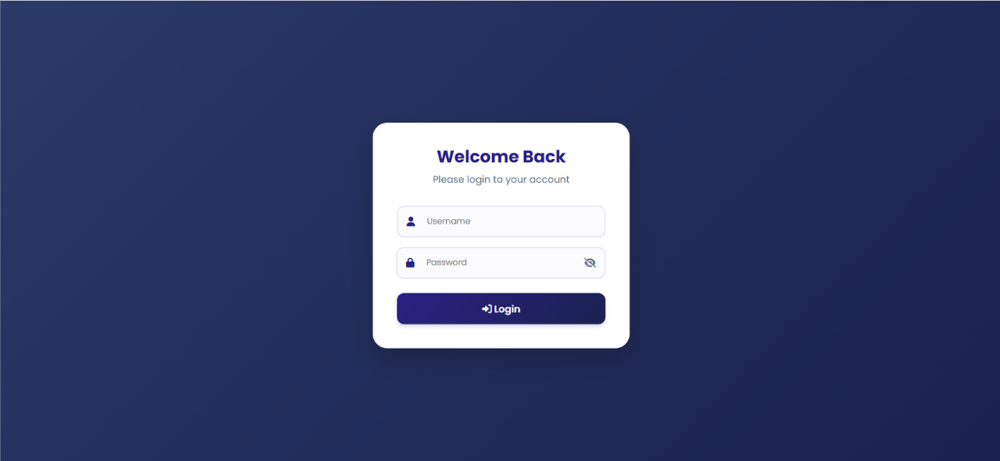
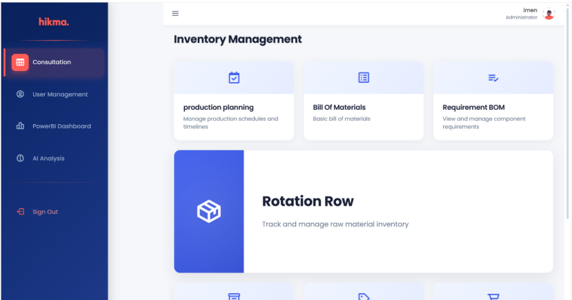
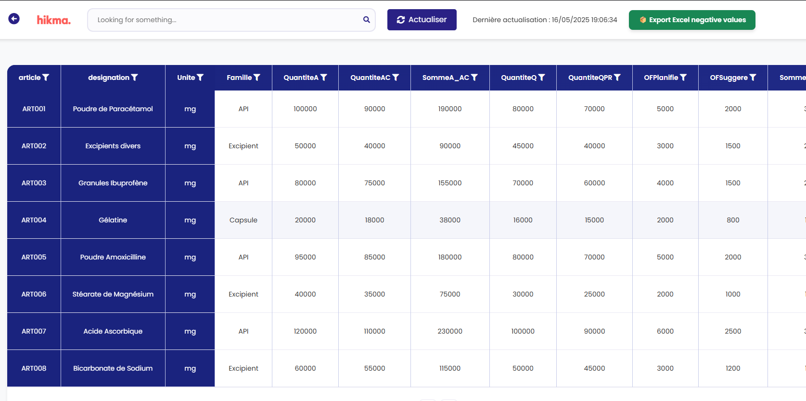
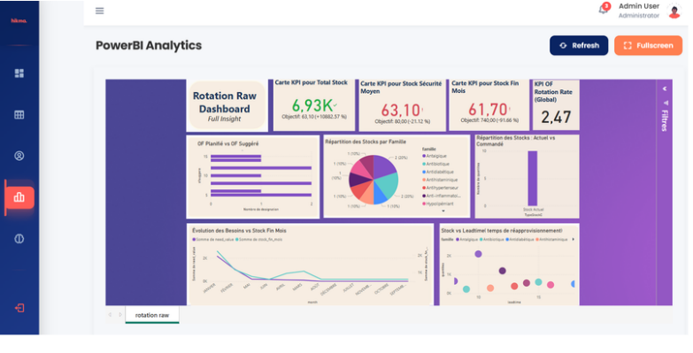
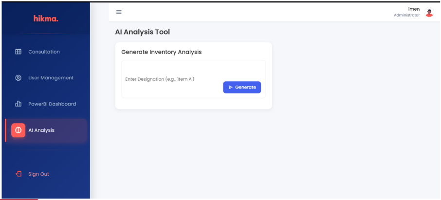

# 📊 Planning Management App

> AI-integrated web application for production planning and raw-material stock management, built during an internship at **Hikma Pharmaceuticals** (Tunisia).


Final Year Project (PFE) for the Bachelor's Degree in **Applied Computer Science for Management – Business Information Systems**, Faculty of Economic Sciences and Management of Nabeul, University of Carthage (2024–2025).

---

## 📌 Table of Contents

- [Context](#-context)
- [Problem](#-problem)
- [Solution & Objectives](#-solution--objectives)
- [Features](#-features)
- [Architecture](#-architecture)
- [Tech Stack](#-tech-stack)
- [Screenshots](#-screenshots)
- [Getting Started](#-getting-started)
- [User Roles](#-user-roles)
- [Project Structure](#-project-structure)
- [Future Improvements](#-future-improvements)
- [Team](#-team)

---

## 🏢 Context

Hikma Pharmaceuticals is a multinational pharmaceutical company with several production sites in Tunisia. Its production, purchasing, finance, supply chain and sales data lives in **Sage** and is centralized in a **data warehouse**. Planning, however, was done outside the system.

## ❗ Problem

Production planning relied on Excel files fed by data exported from the data warehouse (via stored procedures). This caused:

- **No backup** of planning data
- **Ever-growing Excel files**, slow and hard to maintain
- **Inefficiency** in day-to-day planning work
- **A user-unfriendly** experience

## 💡 Solution & Objectives

A centralized web application, **Planning Management**, designed to:

- ✅ Increase productivity
- ✅ Provide time-saving features (automation, exports, notifications)
- ✅ Offer a user-friendly interface
- ✅ Support decision-making with dashboards and AI-generated recommendations

## ✨ Features

### 🔐 Authentication & Access Control
- Secure login with role-based access (Administrator, Planner, Read-only user)
- User account management and role management (Administrator)

### 📅 Production Planning
- Monthly production plans per article: *planned*, *launched* and *remaining* quantities
- Add single or multiple plans, edit existing plans, search and filter by year, reference or label

### 🧾 Bill of Materials (BOM)
- Basic Bill of Materials
- Requirement BOM: raw-material needs per finished product, with remaining quantities to launch and raw-material needs per month

### 📦 Raw-Material Rotation (Stock Tracking)
- Stock overview per article: quantities, planned/suggested production orders, purchase orders, availability
- One-click **refresh** with last-update timestamp
- **Excel export** of negative-stock / low-stock values
- **Low-stock notifications** for administrators

### 📊 Power BI Dashboard
- Embedded interactive dashboard ("Rotation Raw Dashboard")
- KPIs: total stock, average safety stock, end-of-month stock, global rotation rate
- Charts: planned vs. suggested orders, stock by family, current vs. ordered stock, needs vs. end-of-month stock, stock vs. lead time
- Refresh and fullscreen modes

### 🤖 AI Analysis
- Enter an article designation to generate an **inventory analysis and recommended action**
- Export the analysis as a **PDF**
- Send the analysis by **email**

## 🏗️ Architecture

```
┌─────────────┐     ┌──────────────────────┐     ┌───────────────────────┐
│    Sage     │ ──▶ │    Data Warehouse    │ ──▶ │  Stored Procedures    │
│    (ERP)    │     │   (stored data)      │     │  (data extraction)    │
└─────────────┘     └──────────────────────┘     └──────────┬────────────┘
                                                            │
                                                            ▼
┌─────────────┐     REST API      ┌───────────────────────────────────────┐
│   Angular   │ ◀───────────────▶ │           Spring Boot                 │
│  (Frontend) │                   │  Auth · Planning · BOM · Stock · AI   │
└──────┬──────┘                   └───────────────────────────────────────┘
       │
       └──▶ Embedded Power BI dashboard
```

### Main domain entities

`User` · `Roles` · `Article` · `Pdp` (production plan) · `Bill of Materials` · `ReqBom` · `Rotation Raw` · `MonthlyNeed` · `QuantiteUsParMois` · `CdeAchat` · `AnalysisResult`

## 🛠️ Tech Stack

| Layer | Technologies |
|-------|--------------|
| Frontend | Angular |
| Backend | Spring Boot (Java) |
| Data & BI | Sage data warehouse, stored procedures, Power BI |
| AI | AI-powered inventory analysis and recommendations |
| Tools | VS Code, Visual Studio, Draw.io (UML) |

## 🖼️ Screenshots

> Replace the paths below with your own images (e.g. in a `/docs/screenshots` folder).

| Login | Consultation Module |
|:---:|:---:|
|  |  |

| Production Planning | Raw-Material Rotation |
|:---:|:---:|
|  |  |

| Power BI Dashboard | AI Analysis |
|:---:|:---:|
|  |  |

> ⚠️ All data shown is sample/fictional data.

## 🚀 Getting Started

### Prerequisites

- Node.js (LTS) and npm
- Angular CLI (`npm install -g @angular/cli`)
- JDK 17+ (adjust to your version) and Maven
- Access to the database / data warehouse used by the backend
- A Power BI report URL for the embedded dashboard
- An API key for the AI service *(if applicable)*

### 1. Clone the repository

```bash
git clone https://github.com/<your-username>/<your-repo>.git
cd <your-repo>
```

### 2. Backend (Spring Boot)

```bash
cd backend
# Configure src/main/resources/application.properties (DB, mail, AI key...)
mvn clean install
mvn spring-boot:run
```

### 3. Frontend (Angular)

```bash
cd frontend
npm install
ng serve
```

The app is then available at **http://localhost:4200**.

### Configuration

Set the following in `application.properties` (or environment variables). **Never commit real credentials.**

```properties
spring.datasource.url=jdbc:...
spring.datasource.username=<user>
spring.datasource.password=<password>

spring.mail.host=<smtp-host>
spring.mail.username=<email>
spring.mail.password=<password>

ai.api.key=<your-ai-api-key>
```

## 👥 User Roles

| Role | Permissions |
|------|-------------|
| **Read-only user** | Consult the BI dashboard and data tables |
| **Planner** | Everything a read-only user can do + manage tables, generate AI analysis and recommendations, export PDF/Excel, send analysis by email |
| **Administrator** | Everything a planner can do + manage user accounts and roles, receive low-stock notifications |

## 📁 Project Structure

```
.
├── backend/           # Spring Boot REST API
├── frontend/          # Angular application
├── docs/
│   └── screenshots/   # Screenshots used in this README
└── README.md
```

> Adjust to match your actual repository layout.

## 🔮 Future Improvements

- Predictive stock and demand forecasting
- Automated alerts by email/SMS for critical stock levels
- Multi-site support
- Direct, scheduled synchronization with the data warehouse


**Supervised by**
- Sinda Ben Fadhel Azza
- Khawla Nasfi

**Jury members:** Amel El Abed, Raja Ayed

*Faculty of Economic Sciences and Management of Nabeul, University of Carthage — Academic Year 2024–2025*
*Internship host company: Hikma Pharmaceuticals*

---

⭐ If you find this project interesting, feel free to star the repository!
